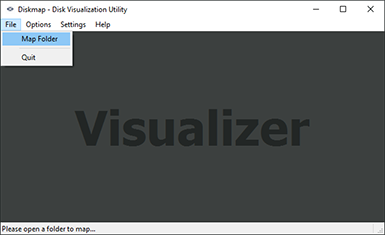
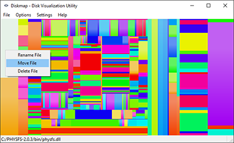
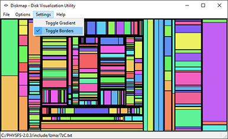

# Diskmap

## Description:
Diskmap is a hard drive space visualization utility. This program displays all the files and folders within a selected location as a rectangular map where each rectangle is proportional to the size of the file it represents. Each rectangular tile on the map is selectable; to select it simply hover over the tile with your mouse. Right click on a selected tile to bring up a popup menu containing options to rename, move and delete the selected file. For optimal viewing, it is recommend to use the application in full screen mode.

	
	

	
	

## Features:
- Graphical visualization of files and folders
- Rename files in the visualizer
- Move files in the visualizer
- Delete files in the visualizer
- Save screenshots of the visualization

## Supports:
- Microsoft Windows 7, 8, 8.1 and 10
- Linux based distributions
- Mac OS X

## Dependencies:
- Python 3 [(Build 3.4)](https://www.python.org/downloads/)
- PyQt 4 [(Build 4.11)](https://riverbankcomputing.com/software/pyqt/download)

## Running the Visualizer:
1. Download and install Python 3
+ Download and install PyQt 4
+ To launch the visualizer, open a terminal or command prompt and type `python3 diskmap.py`

## Troubleshooting:
Please refer to the [Wiki section](https://github.com/SalinderSidhu/Diskmap/wiki) for troubleshooting.

## License:

